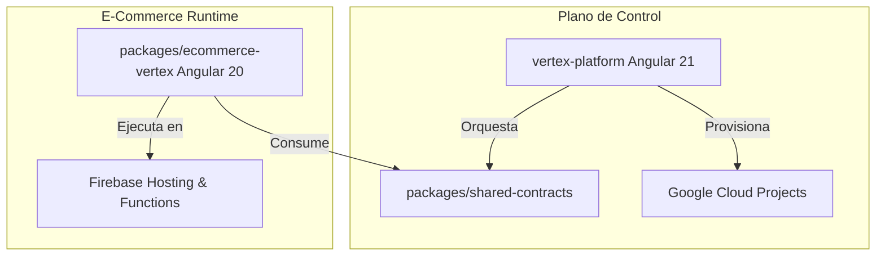

# 🏢 Monorepo Vertex Platform & E-Commerce SaaS

Bienvenido al monorepo corporativo de **Vertex Solutions**. Este repositorio centraliza la factoría automatizada multi-tenant de marca blanca para la creación y gestión de tiendas e-commerce de alto rendimiento.

---

## 🔬 Arquitectura de la Solución

El monorepo está estructurado bajo una topología distribuida multi-tenant que separa el plano de control centralizado de los runtimes independientes de las tiendas.



### Componentes Core
1. **[vertex-platform](file:///Users/juanson/Documents/Vertex/Vertex%20Projects/vertex-platform)**: Plano de control (Control Plane) centralizado para el aprovisionamiento, operaciones y gobernanza del ecosistema multi-tenant de Vertex.
2. **[packages/ecommerce-vertex](file:///Users/juanson/Documents/Vertex/Vertex%20Projects/packages/ecommerce-vertex)**: Plantilla de marca blanca e-commerce altamente personalizable y autogestionada para los inquilinos (tenants).
3. **[packages/shared-contracts](file:///Users/juanson/Documents/Vertex/Vertex%20Projects/packages/shared-contracts)**: Contratos de datos unificados y validación de esquemas (Zod) compartidos entre la plataforma y el e-commerce.

---

## 💻 Requisitos de Entorno

Antes de iniciar el entorno local, asegúrate de cumplir con los siguientes requisitos globales:

- **Node.js**: `v20.x` (LTS recomendada)
- **Firebase CLI**: `^13.x` o superior (para aprovisionamiento y emuladores)
- **Git**: `^2.x`

---

## 🚀 Guía de Inicio Rápido (Menos de 5 minutos)

Para aprovisionar y levantar todo el ecosistema de desarrollo local de manera automatizada:

1. **Instalar dependencias y enlazar workspaces**:
   ```bash
   npm install
   ```

2. **Aprovisionamiento local (Setup Automatizado)**:
   ```bash
   npm run setup
   ```
   *Este comando compilará los contratos compartidos, generará las credenciales y plantillas de configuración de Firebase por defecto para el entorno local.*

3. **Iniciar servicios en paralelo**:
   ```bash
   npm run start
   ```
   *Levanta el panel administrativo (Control Plane) en `http://localhost:4200` y el e-commerce en `http://localhost:4201` con recarga activa.*

---

## 🛡️ Gobernanza del Proyecto & Quality Gates

Mantenemos un estándar de ingeniería de calidad premium mediante compuertas automáticas (Quality Gates) en el ciclo de vida local de Git:

### Flujo de Calidad Local (Git Hooks con Husky)
- **Pre-commit**: Cada commit ejecuta `npm run lint && npm run typecheck` de forma headless. Si existen errores de sintaxis, formato o tipado estricto, el commit se abortará.
- **Pre-push**: Al empujar cambios al repositorio remoto, se ejecuta la suite completa de pruebas unitarias (`npm run test:ci`). Se exige un umbral de cobertura mínimo del **85%** real en statements, branches, functions y lines. De lo contrario, el push será bloqueado automáticamente.

### Gestión de Ramas Core
- **`develop`**: Integración y desarrollo continuo. Todas las ramas de características (`feature/*` o `chore/*`) se desvían de aquí.
- **`main`**: Rama estable de producción. Los cambios sólo entran mediante Pull Requests validados desde `develop` tras pasar el pipeline de CI/CD en verde.
