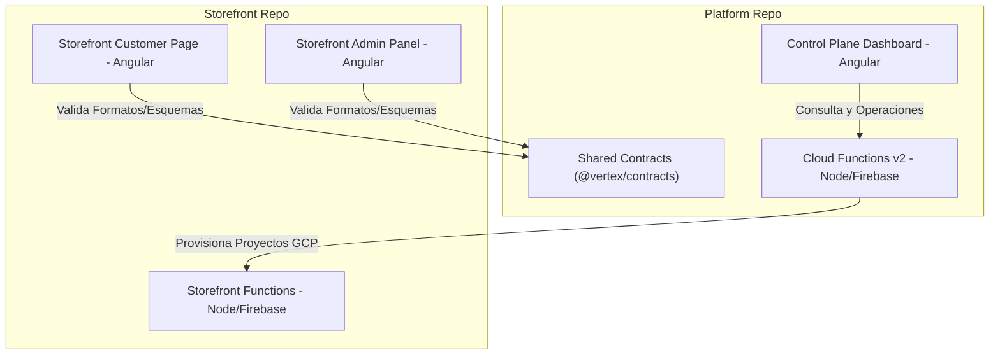

# 🌐 Vertex Platform Ecosystem (Control Plane)

Control plane centralizado para la gobernanza, aprovisionamiento de recursos de infraestructura y ciclo de vida de tiendas independientes en el ecosistema SaaS multi-tenant de **Vertex**.

Este repositorio está estructurado como un **NPM Workspace** (monorepo) que no solo administra la consola administrativa principal de Vertex, sino que también aloja los contratos de validación compartidos y orquesta el entorno de desarrollo unificado (Docker/Emuladores) en conjunto con el repositorio de **Storefront**.

---

## 🏗️ Topología del Ecosistema

El proyecto de Vertex está dividido en dos repositorios hermanos en paralelo:
1. **`platform/`** (Este repositorio): Plano de control, API centralizada y contratos de datos.
2. **`storefront/`** (Repositorio `ecommerce-vertex`): Plantilla cliente para tienda (Frontend) y backoffice.



### 🤝 Consumo de Contratos Compartidos
Para evitar redundancia de código y garantizar consistencia de tipo estricto, el **Storefront** consume los contratos de validación de esquemas Zod (`@vertex/contracts`) directamente desde este repositorio mediante dependencias locales (`file:`) en su `package.json`:
```json
"dependencies": {
  "@vertex/contracts": "file:../platform/packages/shared-contracts"
}
```

---

## 🚀 Inicio Rápido: De Cero a Todo Funcionando (Docker Dev Stack)

El ecosistema cuenta con una suite de desarrollo contenedorizada completa que levanta la plataforma, el storefront, las bases de datos locales, la autenticación y los emuladores de Firebase en un entorno caliente e intercomunicado de manera automatizada.

### 1️⃣ Inicialización por Primera Vez (One-liner de Onboarding)
Asegúrate de tener **Docker Desktop** instalado y en ejecución en tu equipo. Abre una terminal y corre el siguiente comando consolidado:

```bash
mkdir -p "Vertex Projects" && cd "Vertex Projects" && git clone -b develop https://github.com/Vertex-Tech-Devs/vertex-platform.git platform && git clone -b develop https://github.com/Vertex-Tech-Devs/ecommerce-vertex.git storefront && cd platform && bash docker/start.sh
```

*¿Qué hace este comando?*
1. Crea el directorio padre `"Vertex Projects"`.
2. Clona la rama `develop` de ambos repositorios (`platform` y `storefront`) uno al lado del otro.
3. Ingresa a la raíz de `platform`.
4. Ejecuta el script de inicio de Docker (`docker/start.sh`), el cual construye las imágenes, crea los volúmenes para acelerar futuras instalaciones de `node_modules` y levanta todos los emuladores de Firebase.
5. Abre automáticamente pestañas en tu navegador cuando los servidores estén listos.

### 2️⃣ Comandos de Arranque Posteriores
Cuando ya tengas los repositorios clonados, usa estos comandos directos:

* **Con Docker (Recomendado - Completo):**
  ```bash
  # Desde la raíz de platform/
  bash docker/start.sh
  ```
* **Sin Docker (Nativo en el Host):**
  Asegúrate de autenticar tus herramientas de línea de comandos antes del arranque nativo:
  ```bash
  # 1. Autenticación inicial (Solo la primera vez)
  firebase login
  gcloud auth application-default login
  gcloud auth application-default set-quota-project vertex-platform-dev
  
  # 2. Iniciar orquestador local de servicios
  npm run start
  ```

---

## 📁 Estructura de Directorios (Platform Root)

* **`vertex-platform/`**: Proyecto principal de consola.
  * `src/app/`: Frontend independiente en Angular 21 con Signals.
  * `functions/src/`: Controladores de aprovisionamiento de Firebase Cloud Functions v2.
* **`packages/shared-contracts/`**: Paquete NPM local `@vertex/contracts` con esquemas Zod compartidos de Base de Datos y APIs.
* **`docker/`**: Archivos de configuración de imágenes y scripts de entrada para Docker.
* **`scripts/`**: Utilidades de orquestación local (como `dev-e2e.ts`).

---

## ⚙️ Índice de Puertos en Desarrollo Local

Una vez levantado el entorno con Docker o el orquestador nativo, los siguientes servicios estarán accesibles:

* **Platform Admin Dashboard:** [http://localhost:4200](http://localhost:4200)
* **Storefront Cliente (Shop):** [http://localhost:4201/shop?tenantId=tienda-dos](http://localhost:4201/shop?tenantId=tienda-dos)
* **Storefront Admin Panel:** [http://localhost:4201/admin](http://localhost:4201/admin)
* **Firebase Emulator Suite UI:** [http://localhost:4000](http://localhost:4000)
* **Cloud Functions Emulator API:** `http://localhost:5001`
* **Cloud Firestore Emulator:** `http://localhost:8080`

---

## 🛡️ Políticas de Calidad y Git Flow

### QA Local Automatizado
Antes de commitear o abrir un PR, es obligatorio verificar que la suite de QA unificada esté limpia:
```bash
# Ejecutar verificación de linter y compilación estricta de TypeScript
npm run qa:global

# Ejecutar tests unitarios de las Cloud Functions v2
cd vertex-platform/functions && npm run test
```

### Flujo de Ramas (Git Flow)
1. **develop**: Integración activa de desarrollo. Las ramas de feature/chore nacen de `develop` y se reintegran mediante PRs.
2. **main**: Rama estable de producción. Los despliegues productivos se realizan a partir de fusiones de `develop` a `main`.
3. **Merge de PRs**: Direct pushes a `develop` y `main` están bloqueados por reglas del servidor. Todo cambio debe atravesar revisión y validación de CI.

---

📖 **Nota para Desarrolladores:** Para guías de desarrollo de agentes de IA y flujos específicos, consulta [agent.md](agent.md). Para la documentación técnica detallada de la consola Angular, consulta [vertex-platform/README.md](vertex-platform/README.md).
