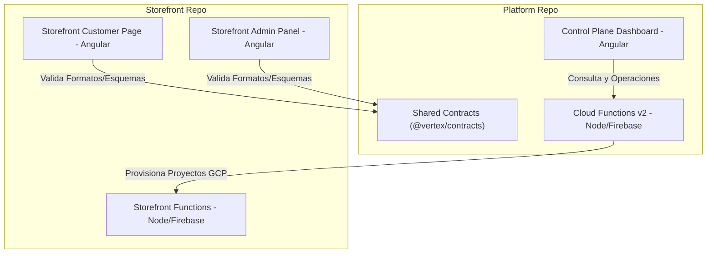

# 🌐 Vertex Platform Ecosystem (Control Plane)

Control plane centralizado para la gobernanza, aprovisionamiento de recursos de infraestructura y ciclo de vida de tiendas independientes en el ecosistema SaaS multi-tenant de **Vertex**.

Este repositorio está estructurado como un **NPM Workspace** (monorepo) que no solo administra la consola administrativa principal de Vertex, sino que también aloja los contratos de validación compartidos y orquesta el entorno de desarrollo unificado (Docker/Emuladores) en conjunto con el repositorio de **Storefront**.

---

## 🏗️ Topología del Ecosistema

El proyecto de Vertex está dividido en dos repositorios hermanos en paralelo:

1. **`platform/`** (Este repositorio): Plano de control, API centralizada y contratos de datos.
2. **`storefront/`** (Repositorio `ecommerce-vertex`): Plantilla cliente para tienda (Frontend) y backoffice.


```mermaid
graph TD
    subgraph Platform Repo
        P_Dashboard[Control Plane Dashboard - Angular]
        P_Backend[Cloud Functions v2 - Node/Firebase]
        Shared_Contracts["Shared Contracts (@vertex/contracts)"]
    end

    subgraph Storefront Repo
        S_Shop[Storefront Customer Page - Angular]
        S_Admin[Storefront Admin Panel - Angular]
        S_Backend[Storefront Functions - Node/Firebase]
    end

    P_Backend -->|Provisiona Proyectos GCP| S_Backend
    S_Shop -->|Valida Formatos/Esquemas| Shared_Contracts
    S_Admin -->|Valida Formatos/Esquemas| Shared_Contracts
    P_Dashboard -->|Consulta y Operaciones| P_Backend
```

### 🤝 Consumo de Contratos Compartidos

Para evitar redundancia de código y garantizar consistencia de tipo estricto, el **Storefront** consume los contratos de validación de esquemas Zod (`@vertex/contracts`) directamente desde este repositorio mediante dependencias locales (`file:`) en su `package.json`:

```json
"dependencies": {
  "@vertex/contracts": "file:../platform/packages/shared-contracts"
}
```

---

## 🚀 Inicio Rápido: De Cero a Todo Funcionando (Docker Dev Stack)

El ecosistema cuenta con una suite de desarrollo contenedorizada completa que levanta la plataforma, el storefront, las bases de datos locales, la autenticación y los emuladores de Firebase en un entorno caliente e intercomunicado de manera automatizada.

### 1️⃣ Inicialización por Primera Vez (One-liner de Onboarding)

Asegúrate de tener **Docker Desktop** instalado y en ejecución en tu equipo. Abre una terminal y corre el siguiente comando consolidado:

```bash
mkdir -p "Vertex Projects" && cd "Vertex Projects" && git clone -b develop https://github.com/Vertex-Tech-Devs/vertex-platform.git platform && git clone -b develop https://github.com/Vertex-Tech-Devs/ecommerce-vertex.git storefront && cd platform && bash docker/start.sh
```

_¿Qué hace este comando?_

1. Crea el directorio padre `"Vertex Projects"`.
2. Clona la rama `develop` de ambos repositorios (`platform` y `storefront`) uno al lado del otro.
3. Ingresa a la raíz de `platform`.
4. Ejecuta el script de inicio de Docker (`docker/start.sh`), el cual construye las imágenes, crea los volúmenes para acelerar futuras instalaciones de `node_modules` y levanta todos los emuladores de Firebase.
5. Abre automáticamente pestañas en tu navegador cuando los servidores estén listos.

### 2️⃣ Comandos de Arranque Posteriores

Cuando ya tengas los repositorios clonados, usa estos comandos directos:

- **Con Docker (Recomendado - Completo):**
  ```bash
  # Desde la raíz de platform/
  bash docker/start.sh
  ```
- **Sin Docker (Nativo en el Host):**
  Asegúrate de autenticar tus herramientas de línea de comandos antes del arranque nativo:

  ```bash
  # 1. Autenticación inicial (Solo la primera vez)
  firebase login
  gcloud auth application-default login
  gcloud auth application-default set-quota-project vertex-platform-dev

  # 2. Iniciar orquestador local de servicios
  npm run start
  ```

---

## 📁 Estructura de Directorios (Platform Root)

- **`vertex-platform/`**: Proyecto principal de consola.
  - `src/app/`: Frontend independiente en Angular 22 con Signals.
  - `functions/src/`: Controladores de aprovisionamiento de Firebase Cloud Functions v2 (billing inteligente, fallback a shared-shard, seeding flat).
  - `scripts/`: Utilidades de orquestación y validación (`validate-firestore-rules.ts` con modo standalone para CI).
  - `firestore.rules` + `firestore.indexes.json`: reglas de seguridad e índices del plano de control.
- **`packages/shared-contracts/`**: Paquete NPM local `@vertex/contracts` con esquemas Zod compartidos de Base de Datos y APIs.
- **`docker/`**: Archivos de configuración de imágenes y scripts de entrada para Docker.
- **`scripts/`**: Utilidades de orquestación local (como `dev-e2e.ts`).

---

## ⚙️ Índice de Puertos en Desarrollo Local

Una vez levantado el entorno con Docker o el orquestador nativo, los siguientes servicios estarán accesibles:

- **Platform Admin Dashboard:** [http://localhost:4200](http://localhost:4200)
- **Storefront Cliente (Shop):** [http://localhost:4201/shop?tenantId=tienda-dos](http://localhost:4201/shop?tenantId=tienda-dos)
- **Storefront Admin Panel:** [http://localhost:4201/admin](http://localhost:4201/admin)
- **Firebase Emulator Suite UI:** [http://localhost:4000](http://localhost:4000)
- **Cloud Functions Emulator API:** `http://localhost:5001`
- **Cloud Firestore Emulator:** `http://localhost:8080`

---

## 🧩 Arquitectura de Datos y Aprovisionamiento (V1.0)

### Modelo de Datos Flat Multi-Tenant

A partir de la versión V1.0 el modelo de datos es **plano y etiquetado por `storeId`** (sin namespaces `tenants/{tenantId}/...`):

```
products/{storeId}-<id>        → { storeId, ... }
categories/{storeId}-<id>      → { storeId, ... }
attributes/{storeId}-<id>      → { storeId, ... }
configuracion/store_{storeId}  → { storeId, tenantId, ... }
configuracion/footer_{storeId} → { storeId, ... }
configuracion/hero_{storeId}   → { storeId, ... }
banners/home_{storeId}         → { storeId, ... }
pages/aboutUs_{storeId}        → { storeId, ... }
orders/{storeId}-<id>          → { storeId, ... }
clients/{storeId}_<email>      → { storeId, ... }
```

### Semillado de Datos de Prueba (`seedSalesAndClients`)

Al aprovisionar una tienda con la opción `seedSalesAndClients: true` (o `includeMockData = true`):

- `seedStoreData` en `seeds.ts` genera las colecciones `products`, `categories`, `attributes`, `clients` y `orders`.
- Los campos de tipo entero son transformados mediante `toFirestoreValue` a la estructura REST `integerValue: String(val)` y las fechas a `timestampValue: ISOString`.
- Todos los documentos quedan scoped por el `storeId` para aislar los datos multi-tenant de la tienda en el shard.

### Colecciones del Plano de Control (Siempre Privadas)

`stores`, `infrastructure_shards`, `provisioning_queue`, `provisioning_logs`, `users`, `admin_roles` — protegidas por el catch-all `match /{document=**} { allow read, write: if isPlatformAdmin(); }`.

### Shards (`infrastructure_shards`)

- Esquema: `status` en mayúsculas (`ACTIVE`, `FULL`, `WARMUP_READY`, ...), `maxCapacity`, `currentStores`, `reservedStores`.
- **Auto-healing**: si no existe un shard `ACTIVE`, se crea automáticamente `shared-dev-01` (`maxCapacity: 35`, `currentStores: 0`).
- Las tiendas **estándar** se asignan directamente a un shard activo **sin** crear proyectos GCP ni vincular billing (`skipGcpSteps` marca `createProject`/`linkBilling`/`addFirebase`/`enableApis` como `done`).

### Billing Inteligente y Fallback

- `pickBillingAccount` consulta `billing_accounts` con `status == 'ACTIVE'` (fallback legacy `billingAccounts`/`active == true`) y filtra `currentProjects < maxProjects`.
- Si una Tienda Dedicada no encuentra cuenta con cupo (`quotaExceeded` / `billing_quota_increase`): `console.warn` + auditoría `provisionStore-billing-fallback` + **conversión automática a Tienda Estándar sobre `shared-dev-01`** para que la tienda se cree al 100%.

### WebApp Única por Tienda

- `webAppDisplayName = vtx-${slug}-${uniqueSuffix}` (últimos 6 caracteres alfanuméricos del `storeId`) para evitar el bloqueo GCP 400 por soft-delete de 30 días.
- La creación de la WebApp usa **siempre el `gcpProjectId` real** (proyecto del shard o `vtx-<slug>` dedicado), con delay de propagación de 3s y hasta 3 reintentos ante `404/NOT_FOUND`.

### Validación de Reglas en CI (Standalone)

`scripts/validate-firestore-rules.ts` detecta `CI=true` / `GITHUB_ACTIONS=true` / `FORCE_STANDALONE=true` y valida **solo** las reglas locales de `vertex-platform` saliendo con `exit 0` en runners aislados (sin depender del repositorio storefront).

---

## 🛡️ Políticas de Calidad y Git Flow

### QA Local Automatizado

Antes de commitear o abrir un PR, es obligatorio verificar que la suite de QA unificada esté limpia:

```bash
# Validar la alineación estructural de reglas de seguridad de Firestore
npm run validate:rules

# Ejecutar verificación de linter, compilación estricta de TypeScript y reglas de Firestore
npm run qa:global

# Ejecutar tests unitarios completos (153 Frontend + 73 Backend)
npm test

# Ejecutar verificación de 0 vulnerabilidades
npm audit
```

### Flujo de Ramas (Git Flow)

1. **develop**: Integración activa de desarrollo. Las ramas de feature/chore nacen de `develop` y se reintegran mediante PRs.
2. **main**: Rama estable de producción. La promoción se realiza **exclusivamente vía Pull Request** de `develop` → `main` (el push directo a `main` está bloqueado por repo rules del servidor).
3. **Back-sync obligatorio**: tras fusionar en `main`, se ejecuta el back-merge `main` → `develop` para mantener 0 divergencia.
4. **Bypass de automatización**: los hooks de `pre-push` exigen `ALLOW_DIRECT_PUSH=true` para push directo a `develop`/`main` en escenarios de automatización/agentes (CI).

---

📖 **Nota para Desarrolladores:** Para guías de desarrollo de agentes de IA y flujos específicos, consulta [agent.md](agent.md). Para la documentación técnica detallada de la consola Angular, consulta [vertex-platform/README.md](vertex-platform/README.md). Para la arquitectura, el aprovisionamiento, el modelo de datos y el CI/CD, consulta [vertex-platform/docs/](vertex-platform/docs/).


---

## Vertex Platform — SaaS Core & GCP Shard Orchestrator

### Architecture
Vertex Platform is the multi-tenant orchestrator that provisions and operates independent GCP tenant projects ("shards") — each shard owns its Firestore data, Firebase Hosting sites and Secret Manager entries for its stores. An orchestrator Service Account (owning the 7 canonical APIs + IAM roles) performs provisioning and healing; stores without their own Mercado Pago credentials operate under the platform master test token and are always kept out of production flows.

### Custom Domains runbook
- `connectDomain` is **idempotent**: connecting a domain that already exists in Firebase Hosting returns `200 OK` with the live DNS records instead of erroring (`ALREADY_EXISTS` → warn + continue).
- `getDomainStatus(storeId, domain)` returns `PENDING_DNS | VALIDATING | ACTIVE` plus `sslStatus` and the required `A` / `TXT` records; in the store-detail **Dominios** tab, the connected-domain card shows the host, a live badge, copy-to-clipboard rows for each record, an **Actualizar Estado** action wired to the callable, and **Desvincular Dominio** behind a confirmation modal (calls `disconnectDomain`, which deletes the Hosting mapping and clears the store doc).
- TLS/SSL issuance by Google typically takes **15 min – 4 h** after the records propagate; the UI surfaces that expectation so merchants can close the screen safely.

### Payments mode clarity
The **Pagos** tab renders an explicit mode banner derived from the resolved token prefix: Amber **MODO SANDBOX DE PLATAFORMA ACTIVO** (no client credentials, test cards only) · Blue **MODO PRUEBAS DEL CLIENTE ACTIVO** (`TEST-`) · Green **MODO PRODUCCIÓN REAL ACTIVO** (`APP_USR-`, real cards only — test users are rejected with *"Una de las partes es de prueba"*).

### Infrastructure self-healing
`triggerHealShards` (admin-guarded, 300 s / 512 MiB) audits the 7 canonical APIs and re-binds the orchestrator IAM roles on every registered shard and returns a per-shard report rendered in Operaciones Cloud → **Sanear Shards de Plataforma**. Runbook: on `IAM_PROPAGATION_FAILED`, re-run the heal (IAM can take ~60 s to propagate; the API circuit breaker retries); verify with the infrastructure tab's readiness table before provisioning new stores.


---

## Vertex Platform — Documentación operativa (Enterprise)

### Orquestador de shards GCP
Vertex Platform aprovisiona y opera tenants GCP independientes ("shards") con su propio Firestore, Hosting y Secret Manager. Una Service Account orquestadora posee las 7 APIs canónicas y los roles IAM de cada shard; el saneamiento se ejecuta con `triggerHealShards` (admin-only, 300 s / 512 MiB) y rinde un reporte por shard en Operaciones Cloud → Infraestructura.

### Ciclo de vida de dominios
`connectDomain` es idempotente (un dominio ya conectado responde 200 con los DNS vigentes). `getDomainStatus` devuelve `PENDING_DNS | VALIDATING | ACTIVE` + registros A/TXT; `disconnectDomain` limpia Hosting y el doc de la tienda. La pestaña Dominios de cada tienda muestra estado, registros con copiado y acciones.

### Flujo de pagos y órdenes (integrado con ecommerce-vertex)
- `createPaymentPreference` persiste la orden como `PENDING_PAYMENT` (`stockDecremented:false`, `isPaid:false`) — **el stock solo se descuenta en el webhook `approved`** (transacción idempotente con margen de seguridad no-negativo).
- El `notification_url` viaja con `tenant` y `projectId` del shard; el webhook tolera `PERMISSION_DENIED` de Secret Manager y continúa con el token real espejado en Firestore del shard (nunca cae al master TEST si la tienda tiene credenciales).
- Preferencias vencidas se regeneran (sin links muertos); rechazadas/canceladas/expiradas pasan a `CANCELLED_UNPAID` con stock devuelto y sin impacto en métricas.
- Clientes se registran en el **shard** (no en el master) desde el webhook aprobado: la sección Clientes del dashboard refleja compras reales.

### Monitor y logs por tienda
La pestaña **Monitor** de cada tienda expone los logs de `ecommerce-vertex` (Cloud Logging) filtrados por slug/severidad/ventana vía el callable `getStoreLogs`. Runbook IAM:
`gcloud projects add-iam-policy-binding ecommerce-vertex --member=serviceAccount:<PLATFORM_RUNTIME_SA> --role=roles/logging.viewer`
(la SA runtime de platform se obtiene con `gcloud functions describe <fn> --project=vertex-platform-app --format='value(serviceConfig.serviceAccountEmail)'`).

### Alertas en producción
`watchdogPlatformAlerts` (cada 60 min) detecta errores del flujo de pagos en Cloud Logging y tiendas en estado de riesgo; persiste alertas deduplicadas en `alerts/{key}`. El **Centro de Alertas** (`/settings/alerts`) permite filtrarlas y marcarlas resueltas. Runbook: ante `IAM_PROPAGATION_FAILED` re-ejecutar `triggerHealShards`; los permisos de logs/SMTP se corrigen con los comandos IAM documentados arriba.

### Tema y estilo
Tema dual (claro/oscuro Material 3) con toggle persistente; todos los estilos se basan en tokens CSS (`--platform-*`) definidos en `src/styles.scss` para ambos `data-theme`.

### Calidad y entrega
Gates por fase: `npm run typecheck && npm run lint && npm test && npm run build` + `npm --prefix functions run build && npm --prefix functions test`. Rama `develop` = `main` con **0 divergencia**; prohibido tocar `version` o crear tags; deploys monitoreados hasta `success`.
