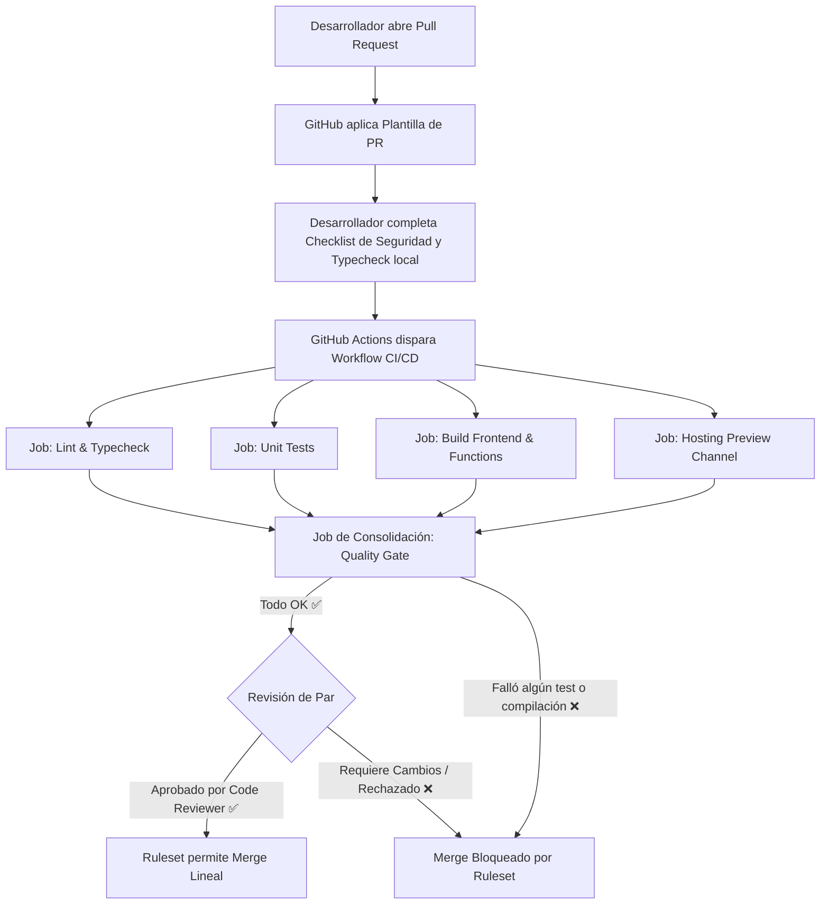

# 🛡️ Guía de Configuración de GitHub Branch Rulesets

Esta guía técnica proporciona el plano detallado y las instrucciones paso a paso para configurar los **Rulesets de GitHub (Reglas de Rama)** en el repositorio de `vertex-platform`. Los Rulesets representan el estándar moderno de GitHub para proteger el flujo de trabajo, reemplazar las antiguas branch protections y asegurar que ningún código llegue a producción sin auditoría previa.

---

## 📋 Reglas Generales de la Rama Protegida

Definiremos dos rulesets clave para proteger las dos ramas principales de integración y despliegue continuo:
1. **`main`**: Despliegues automatizados a Producción (`vertex-platform-app`).
2. **`develop`**: Despliegues automatizados a Desarrollo / Staging (`vertex-platform-dev`).

---

## 🔧 Paso a Paso: Configuración en GitHub

Para configurar estas reglas en la interfaz web de GitHub:

1. Ve a la página principal del repositorio en GitHub.
2. Haz clic en la pestaña **Settings** (Ajustes) en la barra superior.
3. En el menú lateral izquierdo, bajo la sección **Code and automation**, haz clic en **Rules** -> **Rulesets**.
4. Haz clic en el botón verde **New ruleset** en la esquina superior derecha y selecciona **New branch ruleset**.

Sigue las configuraciones detalladas a continuación para cada uno de los dos Rulesets requeridos.

---

## 1. Ruleset: Protección de Producción (`main`)

Este ruleset asegura la máxima estabilidad de la rama de producción, forzando auditoría rigurosa y verificaciones automatizadas.

### ⚙️ Metadatos Básicos
* **Ruleset Name**: `Production Protection (main)`
* **Enforcement status**: **Active** (Activo)
* **Bypass list**: Dejar vacío. *Ningún usuario o administrador debe saltarse las compuertas de seguridad en producción.*

### 🎯 Target Branches (Ramas Objetivo)
* Selecciona **Include by name** y añade:
  * `main`

### 🔒 Rules (Reglas a Enforzar)

#### A. Restringir Eliminaciones y Empujes Directos
* **[x] Restrict deletions**: Impide que cualquiera borre la rama `main`.
* **[x] Restrict updates**: Impide empujes directos (`git push` directo a `main` bloqueado). Todos los cambios deben entrar a través de Pull Request.

#### B. Requerir Pull Request antes de Fusionar (Merge)
* **[x] Require a pull request before merging**:
  * **Required approvals**: `1` (Mínimo una revisión y aprobación por parte de otro desarrollador/arquitecto).
  * **[x] Dismiss stale pull request approvals when new commits are pushed**: Si se sube nuevo código a la PR, las aprobaciones previas se descartan automáticamente para obligar a una nueva revisión.
  * **[x] Require review from Code Owners**: (Opcional, si existe archivo `CODEOWNERS`).

#### C. Requerir Verificaciones de Estado (Status Checks)
* **[x] Require status checks to pass before merging**:
  * **Status checks that must pass**:
    * Buscar y añadir: **`Quality Gate`** (Este es el job crítico de nuestro workflow `ci.yml`).
  * **[x] Require branches to be up to date before merging**: Asegura que la rama de la PR se actualice con los últimos cambios de `main` antes de poder fusionar, previniendo conflictos silenciosos.

#### D. Mantener Historial Lineal
* **[x] Require linear history**: Exige que todos los commits de la PR se fusionen utilizando técnicas que dejen un historial plano y limpio (e.g., *Squash and merge* o *Rebase and merge*). Se prohíben los *merge commits* clásicos con bifurcaciones desordenadas.

---

## 2. Ruleset: Protección de Desarrollo (`develop`)

Este ruleset protege la rama de integración diaria para asegurar que las compilaciones y pruebas no se rompan para el equipo de desarrollo.

### ⚙️ Metadatos Básicos
* **Ruleset Name**: **`Integration Protection (develop)`**
* **Enforcement status**: **Active**
* **Bypass list**: Opcionalmente, se puede añadir el rol de `Owner` o un bot específico con permisos de bypass en caso de emergencias extremas, aunque se desaconseja para el desarrollo rutinario.

### 🎯 Target Branches (Ramas Objetivo)
* Selecciona **Include by name** y añade:
  * `develop`

### 🔒 Rules (Reglas a Enforzar)

#### A. Restringir Eliminaciones y Empujes Directos
* **[x] Restrict deletions**: Impide borrar la rama `develop`.
* **[x] Restrict updates**: Impide empujes directos a `develop`. Obliga a abrir una Pull Request desde ramas de características (e.g., `feature/*`, `bugfix/*`).

#### B. Requerir Pull Request antes de Fusionar
* **[x] Require a pull request before merging**:
  * **Required approvals**: `1` (Garantiza que al menos un par valide los cambios funcionales).
  * **[x] Dismiss stale pull request approvals when new commits are pushed**.

#### C. Requerir Verificaciones de Estado (Status Checks)
* **[x] Require status checks to pass before merging**:
  * **Status checks that must pass**:
    * Buscar y añadir: **`Quality Gate`**
  * **[x] Require branches to be up to date before merging**.

#### D. Mantener Historial Lineal
* **[x] Require linear history**.

---

## 💬 3. Validación de Nomenclatura de Commits (Conventional Commits)

Adicionalmente, se recomienda activar la regla de metadatos de commit para garantizar la consistencia en el historial de Git y facilitar la generación de Notas de Lanzamiento (Release Notes):

1. Dentro de cualquiera de los Rulesets, baja hasta la sección **Metadata restrictions**.
2. Activa **[x] Restrict commit message pattern** (Restringir patrón de mensajes de commit).
3. Configura las siguientes opciones:
   * **Rule type**: **Must match pattern** (Debe coincidir con el patrón).
   * **Pattern**: `^(feat|fix|docs|style|refactor|perf|test|build|ci|chore|revert)(\(.+\))?: .{1,100}`
   * **Custom error message**: *"Mensaje de commit inválido. Por favor, utiliza el formato de Conventional Commits (e.g., 'feat(stores): add domain whitelisting support')."*

---

## 🛡️ Estructura del Ecosistema de Calidad

El siguiente diagrama de flujo ilustra cómo interactúan el Ruleset de GitHub, la plantilla de PR y el workflow de CI para actuar como la compuerta final antes de integrar código:

Con este esquema implementado, la plataforma `vertex-platform` adopta una arquitectura de entrega continua de nivel empresarial, previniendo regresiones de tipos, fallas funcionales y vulnerabilidades de seguridad antes de que lleguen a interactuar con los datos del usuario.
